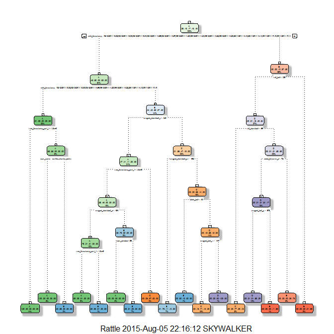

# Coursera Practical Machine Learning - Project Writeup
Writeup by Lim Min Chim  
5 Aug 2015  

## Background

Using devices such as Jawbone Up, Nike FuelBand, and Fitbit it is now possible to collect a large amount of data about personal activity relatively inexpensively. These type of devices are part of the quantified self movement - a group of enthusiasts who take measurements about themselves regularly to improve their health, to find patterns in their behavior, or because they are tech geeks. One thing that people regularly do is quantify how much of a particular activity they do, but they rarely quantify how well they do it. In this project, my goal will be to use data from accelerometers on the belt, forearm, arm, and dumbell of 6 participants. They were asked to perform barbell lifts correctly and incorrectly in 5 different ways. More information is available from the website [here:](http://groupware.les.inf.puc-rio.br/har) (see the section on the Weight Lifting Exercise Dataset).


## Data

The training data for this project are available from [here](https://d396qusza40orc.cloudfront.net/predmachlearn/pml-training.csv).

The test data are available from [here](https://d396qusza40orc.cloudfront.net/predmachlearn/pml-testing.csv).

The data for this project comes from this [original source](http://groupware.les.inf.puc-rio.br/har). 

## Objective

* The goal of this project is to predict the manner of performing unilateral dumbbell biceps curls based on data from accelerometers on the belt, forearm, arm, and dumbell of 6 participants. This is the "classes" variable in the training set. This is the "classe" variable in the training set. The 5 possible methods include:
** A: exactly according to the specification
** B: throwing the elbows to the front
** C: lifting the dumbbell only halfway
** D: lowering the dumbbell only halfway
** E: throwing the hips to the front
* This report will describe how I built the model, how I used cross validation,  the expected out-of-sample error and explain the choices made.
* I will subsequently use the prediction model to predict 20 different test cases.

## Reproducibility

To produce the same results as me, you need to install certain packages and load the corresponding libraries and set a psueudo-random seed in your working environment.


```r
library(caret)
library(rpart)
library(rpart.plot)
library(RColorBrewer)
library(rattle)
library(randomForest)
library(e1071)

set.seed(87654321)
```

## Getting the data

For efficiency, the following code downloads the training and testing data if they have not been downloaded yet. 

```r
trainDataUrl <- "http://d396qusza40orc.cloudfront.net/predmachlearn/pml-training.csv"
if (!file.exists("./data/pml-training.csv")) {
    download.file(trainDataUrl, "./data/pml-training.csv")
    }
# reads data into memory & replaces blanks with NA  
trainingAll <- read.csv("./data/pml-training.csv",na.strings=c("NA", "#DIV/0!",""))

testDataUrl  <- "http://d396qusza40orc.cloudfront.net/predmachlearn/pml-testing.csv"
if (!file.exists("./data/pml-testing.csv")){
    download.file(testDataUrl, "./data/pml-testing.csv")
    }   
# reads data into memory & replaces blanks with NA  
testingAll <- read.csv("./data/pml-testing.csv", na.strings=c("NA","#DIV/0!",""))

trainingAll$classe <- as.factor(trainingAll$classe)
```

## Partioning the training set into two
Partioning Training data set into two data sets, 60% for myTraining, 40% for myTesting:


```r
inTrain <- createDataPartition(y=trainingAll$classe, p=0.6, list=FALSE)
myTraining <- trainingAll[inTrain, ]
myTesting <- trainingAll[-inTrain, ]
dim(myTraining)
```

```
## [1] 11776   160
```

```r
dim(myTesting)
```

```
## [1] 7846  160
```


## Cleaning up the data
The following steps were taken to clean up the training data:

1. Cleaning up NearZeroVariance (NZV) variables 

```r
myDataNZV <- nearZeroVar(myTraining, saveMetrics=TRUE)

myNZVvars <- names(myTraining) %in% c("new_window", "kurtosis_roll_belt", "kurtosis_picth_belt",
"kurtosis_yaw_belt", "skewness_roll_belt", "skewness_roll_belt.1", "skewness_yaw_belt",
"max_yaw_belt", "min_yaw_belt", "amplitude_yaw_belt", "avg_roll_arm", "stddev_roll_arm",
"var_roll_arm", "avg_pitch_arm", "stddev_pitch_arm", "var_pitch_arm", "avg_yaw_arm",
"stddev_yaw_arm", "var_yaw_arm", "kurtosis_roll_arm", "kurtosis_picth_arm",
"kurtosis_yaw_arm", "skewness_roll_arm", "skewness_pitch_arm", "skewness_yaw_arm",
"max_roll_arm", "min_roll_arm", "min_pitch_arm", "amplitude_roll_arm", "amplitude_pitch_arm",
"kurtosis_roll_dumbbell", "kurtosis_picth_dumbbell", "kurtosis_yaw_dumbbell", "skewness_roll_dumbbell",
"skewness_pitch_dumbbell", "skewness_yaw_dumbbell", "max_yaw_dumbbell", "min_yaw_dumbbell",
"amplitude_yaw_dumbbell", "kurtosis_roll_forearm", "kurtosis_picth_forearm", "kurtosis_yaw_forearm",
"skewness_roll_forearm", "skewness_pitch_forearm", "skewness_yaw_forearm", "max_roll_forearm",
"max_yaw_forearm", "min_roll_forearm", "min_yaw_forearm", "amplitude_roll_forearm",
"amplitude_yaw_forearm", "avg_roll_forearm", "stddev_roll_forearm", "var_roll_forearm",
"avg_pitch_forearm", "stddev_pitch_forearm", "var_pitch_forearm", "avg_yaw_forearm",
"stddev_yaw_forearm", "var_yaw_forearm")

myTraining <- myTraining[!myNZVvars]
dim(myTraining)
```

```
## [1] 11776   100
```

2. Remove the ID variable to avoid interference with the Machine Learning algorithm

```r
myTraining <- myTraining[c(-1)]
```

3. Cleaning up variables with too many NAs.
* Variables with more than 60% of NA's will be removed.


```r
trainingV3 <- myTraining # creating another subset to iterate within the loop
for(i in 1:length(myTraining)) { 
        # If number of NAs > 60% of total observations
        if( sum( is.na( myTraining[, i] ) ) /nrow(myTraining) >= .6 ) { 
        for(j in 1:length(trainingV3)) {
            # if columns are the same, remove the column        
            if( length( grep(names(myTraining[i]), names(trainingV3)[j]) ) ==1)  { 
                trainingV3 <- trainingV3[ , -j] 
            }   
        } 
    }
}
dim(trainingV3)
```

```
## [1] 11776    58
```

```r
# save back to the training dataset
myTraining <- trainingV3
rm(trainingV3)
```

4. Repeat the same steps for myTesting and testing data sets.

```r
clean1 <- colnames(myTraining)
# The "classe" column is removed
clean2 <- colnames(myTraining[, -58]) 
myTesting <- myTesting[clean1]
testingAll <- testingAll[clean2]
# NOTE: The problem_id (different from the ID column in training dataset), will be removed
dim(myTesting)
```

```
## [1] 7846   58
```

```r
dim(testingAll)
```

```
## [1] 20 57
```

In order to ensure proper functioning of Decision Trees and especially RandomForest Algorithm with the Test data set (data set provided), we need to coerce the data into the same type.

```r
for (i in 1:length(testingAll) ) {
        for(j in 1:length(myTraining)) {
        if( length( grep(names(myTraining[i]), names(testingAll)[j]) ) ==1)  {
            class(testingAll[j]) <- class(myTraining[i])
        }      
    }      
}
# NOTE: Row 2 is not useful, hence will be removed to ensure coersion works
testing <- rbind(myTraining[2, -58] , testingAll)
testing <- testing[-1,]
```


## Decision Tree -- Using Machine Learning Algorithms for Prediction

```r
modFitA1 <- rpart(classe ~ ., data=myTraining, method="class")
# To view Decision Tree with fancy
fancyRpartPlot(modFitA1)
```

 

Performing prediction ...

```r
predictionsA1 <- predict(modFitA1, myTesting, type = "class")
```

Use Confusion Matrix to test results ...

```r
confusionMatrix(predictionsA1, myTesting$classe)
```

```
## Confusion Matrix and Statistics
## 
##           Reference
## Prediction    A    B    C    D    E
##          A 2155   75   10    1    0
##          B   54 1235   77   61    0
##          C   23  199 1257  138   55
##          D    0    9   13  892   99
##          E    0    0   11  194 1288
## 
## Overall Statistics
##                                           
##                Accuracy : 0.8701          
##                  95% CI : (0.8625, 0.8775)
##     No Information Rate : 0.2845          
##     P-Value [Acc > NIR] : < 2.2e-16       
##                                           
##                   Kappa : 0.8357          
##  Mcnemar's Test P-Value : NA              
## 
## Statistics by Class:
## 
##                      Class: A Class: B Class: C Class: D Class: E
## Sensitivity            0.9655   0.8136   0.9189   0.6936   0.8932
## Specificity            0.9847   0.9697   0.9359   0.9816   0.9680
## Pos Pred Value         0.9616   0.8655   0.7518   0.8806   0.8627
## Neg Pred Value         0.9863   0.9559   0.9820   0.9423   0.9758
## Prevalence             0.2845   0.1935   0.1744   0.1639   0.1838
## Detection Rate         0.2747   0.1574   0.1602   0.1137   0.1642
## Detection Prevalence   0.2856   0.1819   0.2131   0.1291   0.1903
## Balanced Accuracy      0.9751   0.8916   0.9274   0.8376   0.9306
```

```r
# Overall Statistics
#               Accuracy : 0.8701          
#                 95% CI : (0.8725, 0.8775)
#    No Information Rate : 0.2845          
#    P-Value [Acc > NIR] : < 2.2e-16

#                  Kappa : 0.8357 
# Mcnemar's Test P-Value : NA 
```


## Random Forests -- Using Machine Learning Algorithms for Prediction

```r
modFitB1 <- randomForest(classe ~. , data=myTraining)
```

Predicting in-sample error ...

```r
predictionsB1 <- predict(modFitB1, myTesting, type = "class")
```

Use Confusion Matrix to test results ...

```r
confusionMatrix(predictionsB1, myTesting$classe)
```

```
## Confusion Matrix and Statistics
## 
##           Reference
## Prediction    A    B    C    D    E
##          A 2231    1    0    0    0
##          B    1 1515    3    0    0
##          C    0    2 1362    1    0
##          D    0    0    3 1285    2
##          E    0    0    0    0 1440
## 
## Overall Statistics
##                                           
##                Accuracy : 0.9983          
##                  95% CI : (0.9972, 0.9991)
##     No Information Rate : 0.2845          
##     P-Value [Acc > NIR] : < 2.2e-16       
##                                           
##                   Kappa : 0.9979          
##  Mcnemar's Test P-Value : NA              
## 
## Statistics by Class:
## 
##                      Class: A Class: B Class: C Class: D Class: E
## Sensitivity            0.9996   0.9980   0.9956   0.9992   0.9986
## Specificity            0.9998   0.9994   0.9995   0.9992   1.0000
## Pos Pred Value         0.9996   0.9974   0.9978   0.9961   1.0000
## Neg Pred Value         0.9998   0.9995   0.9991   0.9998   0.9997
## Prevalence             0.2845   0.1935   0.1744   0.1639   0.1838
## Detection Rate         0.2843   0.1931   0.1736   0.1638   0.1835
## Detection Prevalence   0.2845   0.1936   0.1740   0.1644   0.1835
## Balanced Accuracy      0.9997   0.9987   0.9976   0.9992   0.9993
```

```r
# Overall Statistics
#              Accuracy : 0.9983          
#                95% CI : (0.9972, 0.9991)
#   No Information Rate : 0.2845         
#   P-Value [Acc > NIR] : < 2.2e-16  

#                 Kappa : 0.9979         
# Mcnemar's Test P-Value: NA 
```

As can be observed, Random Forests produce better results.

## Generating files for assignment submission
For Random Forests we use the following formula, which gave a much better prediction:

```r
predictionsB2 <- predict(modFitB1, testing, type = "class")
predictionsB2
```

```
## 22  3  4  5  6  7  8  9 10 11 12 13 14 15 16 17 18 19 20 21 
##  B  A  B  A  A  E  D  B  A  A  B  C  B  A  E  E  A  B  B  B 
## Levels: A B C D E
```

Use provided function to generate files with the corresponding problem in the test data set.
These files are for the assignment submission.

```r
pml_write_files = function(x){
  n = length(x)
  for(i in 1:n){
    filename = paste0("./results1/problem_id_",i,".txt")
    write.table(x[i],file=filename,quote=FALSE,row.names=FALSE,col.names=FALSE)
  }
}

pml_write_files(predictionsB2)
```

THE END
